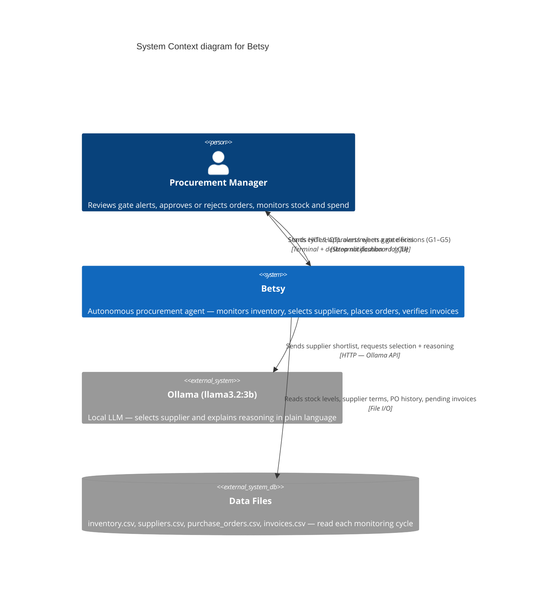
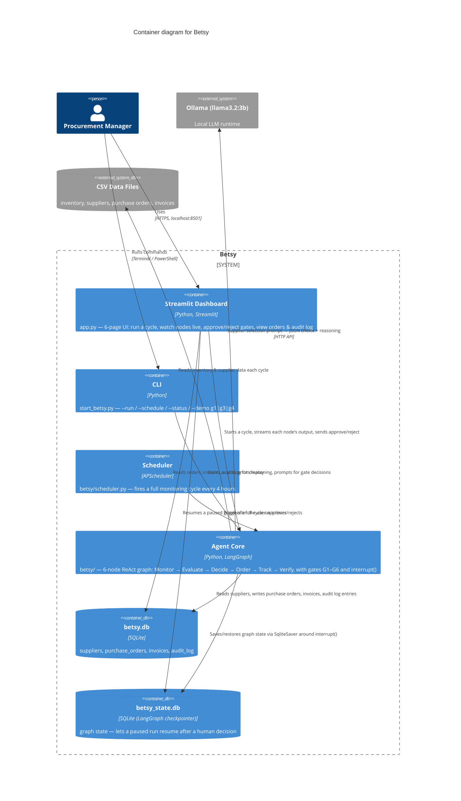
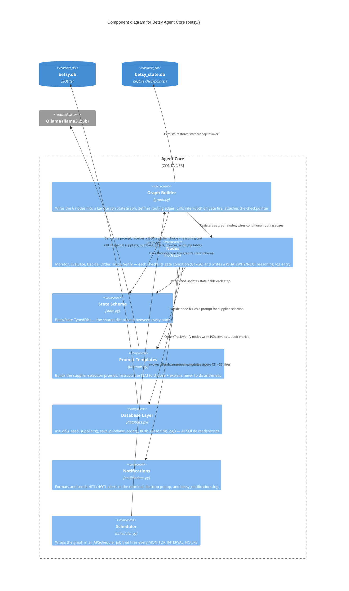
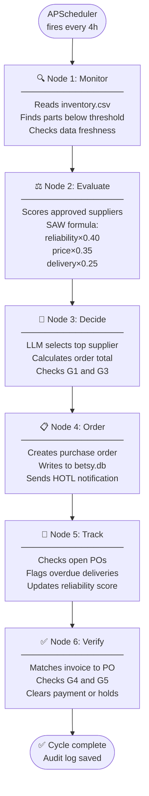
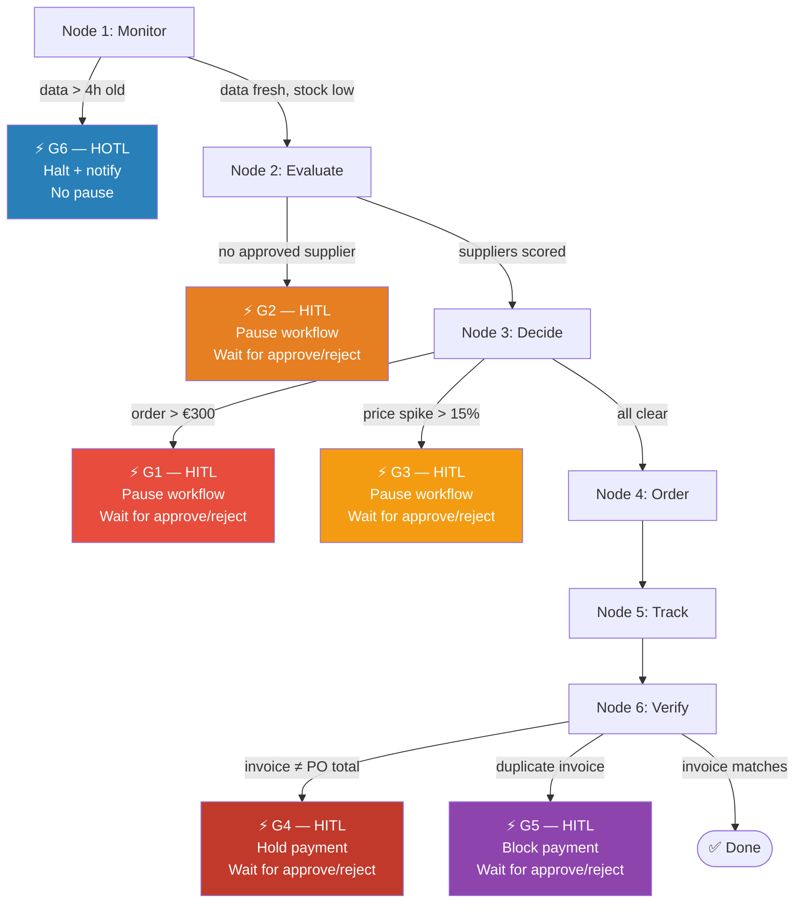

# Betsy — Architecture Diagram

## C4 Model — System, Container, and Component Views

### Level 1 — System Context



### Level 2 — Containers



### Level 3 — Components (inside Agent Core)



---

## 6-Node Workflow with Gate Positions

### Full Workflow (normal cycle, no gates firing)



---

### Gate Positions — Where Each Risk Check Sits



---

### Human Oversight Model — Three Levels

```
FULL AUTONOMY          HOTL                    HITL
──────────────         ──────────────────      ──────────────────────────
Order < €300           Order placed            Order > €300       G1
No price spike         Notification sent       No approved supp.  G2
Approved supplier      User can override       Price spike >15%   G3
Invoice matches        within 1 hour           Invoice mismatch   G4
                                               Duplicate invoice  G5
Betsy acts alone       Betsy acts + alerts     Betsy STOPS
                                               User must decide
```

---

### State Dictionary — Data That Flows Between Nodes

```
BetsyState (shared across all 6 nodes)
├── run_id                    ← unique ID per cycle
├── inventory_snapshot        ← all rows from inventory.csv
├── low_stock_items           ← parts below reorder threshold
├── data_age_hours            ← for G6 freshness check
├── candidate_suppliers       ← scored + ranked list
├── selected_supplier         ← chosen by LLM
├── order_quantity            ← from inventory reorder_quantity
├── order_value               ← unit_price × quantity (Python)
├── decision                  ← "order" | "skip" | "escalate"
├── purchase_order            ← PO dict written to DB
├── invoice                   ← invoice dict for G4/G5
├── verification_result       ← "match" | "mismatch" | "duplicate"
├── gate                      ← "G1"–"G6" | None
├── gate_reason               ← plain-language explanation
├── escalation_payload        ← full context sent to human
├── human_response            ← "approve" | "reject"
└── reasoning_log             ← WHAT/WHY/NEXT from every node
```

---

*Architecture Diagram — Betsy Autonomous Procurement Agent — GenAI Semester 2026*
